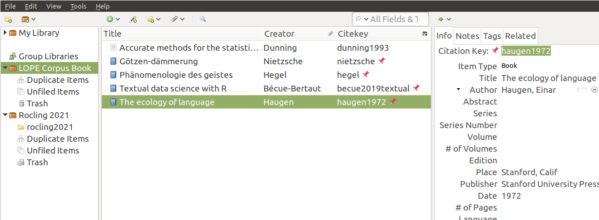

# Pandoc's Markdown Syntax

## 文獻引用

文獻引用是透過 `.bib` 檔裡的書目資料以及 [Pandoc's Citation syntax](https://pandoc.org/MANUAL.html#citation-syntax) 達成。`.bib` 檔的產生方式可以由 Endnote, Zotero, JabRef 等書目管理軟體匯出。匯出後，將檔名命名為 `ref.bib` 取代根目錄中原本的檔案。

下方是 `.bib` 內的一篇引用資料 (一個 `.bib` 可以有很多篇)：

```bib
@book{mihaly1990,
	address = {New York},
	title = {Flow : the psychology of optimal experience},
	isbn = {0-06-016253-8},
	language = {English},
	publisher = {Harper \& Row},
	author = {Csikszentmihalyi, Mihaly},
	year = {1990},
	keywords = {Happiness},
}
```

其中第一行的 `mihaly1990` 即為 **citation key**。Pandoc 透過 `@citekey` (e.g., `@mihaly1990`) 在 `.md` 檔中插入 citation。匯出論文時，Pandoc 會依據 `cite-style.csl` 的格式自動產生引用文獻。下方為一些文獻引用語法的範例，詳見 [Pandoc's Citation syntax](https://pandoc.org/MANUAL.html#citation-syntax)。

|          | 內文                                  | 輸出 (根據 `.csl` 改變)             |
|----------|---------------------------------------|-------------------------------------|
| 單篇     | `[@stanford2008]`                     | [@stanford2008]                     |
| 多篇     | `[@stanford2008; @kassin2017]`        | [@stanford2008; @kassin2017]        |
| 文內引用 | `@stanford2008 says ...`              | @stanford2008 says                  |
| 隱藏作者 | `Stanford says blah [-@stanford2008]` | Stanford says blah [-@stanford2008] |
| 其它註解 | `see @kassin2017, pp. 33-35`          | see @kassin2017, pp. 33-35          |

Table: 文獻引用語法 {#tbl:citation}

### Better Citation Key

通常圖書館或出版商所提供的書目資料 (e.g., `.ris`, `.bib`) 的 citation key 都長得相當醜陋。透過書目管理軟體 Zotero 以及其擴充套件 [Beter BibTeX](https://retorque.re/zotero-better-bibtex) 能夠讓你自行定義 citation key 的格式。例如，模板中的 `references.bib` 皆是以「作者姓名 + 年份」(`[auth:lower][year]`) 做為 citation key 的格式。

{#fig:zotero-citekey}


## 交叉引用 (cross-referencing) {#sec:cross-ref}

### Image

{#fig:figure width=75%}

以 `@fig:figure` 交叉引用 @fig:figure。前綴 (e.g., `圖`/`Figure`、`表`/`Table`) 請於 `setup.md` 進行設定。


### Table

|      | 定義                              | 引用      |
|------|-----------------------------------|-----------|
| 段落 | `Section Two {#sec:2}`            | `@sec:id` |
| 圖片 | `{#fig:id}` | `@fig:id` |
| 公式 | `$$ y = mx + b $$ {#eq:id}`       | `@eq:id`  |
| 表格 | `Table: Caption. {#tbl:id}`       | `@tbl:id` |

Table: Cross-reference 語法 {#tbl:cross-ref}

關於 cross-reference 語法，見 @sec:cross-ref 的 @tbl:cross-ref。


### Equation

$$
\begin{aligned}
\frac{a}{b} &= 1 \\
c &= 1
\end{aligned}
$$ 
{#eq:equation-1}

使用 `@eq:equation-1` 交叉引用 @eq:equation-1。


### 程式碼

```{#lst:codeblock1 .python caption="Python 程式碼"}
for c in "Hello World!":
    print(c)
```

使用 `@lst:codeblock1` 交叉引用 @lst:codeblock1。


## 複雜表格

Pandoc's Markdown 支援一些簡約的[表格語法](https://pandoc.org/MANUAL.html#tables)，但有時候我們需要製作更複雜的表格 (例如，某些格子佔兩行或兩列以上)，而 Pandoc's Markdown 尚未[^grid-table]有語法支援。這時我們可以利用表格製作工具如 [TablesGenerator.com][tablesgenerator] 去製作出 LaTeX 以及 HTML 的表格，再使用 Pandoc 的[擴充程式][insertTables]將這些表格自動插入輸出文件中。要使用這功能，

1. 在 Markdown 內文於想新增表格處新增一個以 Markdown 語法撰寫的 placeholder table，並以 [pandoc-crossref][pandoc-crossref] 的 table cross-referencing 語法標記 ID (e.g., `tbl:custom-table`，見 @sec:cross-ref) 
2. 將製作出來的表格程式碼複製貼上至 `chapters/tables.tex` (LaTeX 語法) 以及 `chapters/tables.html` (HTML 語法)
3. 並在表格程式碼的前後加上特殊標記 `<COMMENT> tbl:table-id <COMMENT>` (開頭) 與 `<COMMENT> END <COMMENT>` (結尾)。例如 HTML 的語法會是 `<!-- tbl:custom-table -->` (開頭) 與 `<!-- END -->` (結尾)；LaTeX 的語法是 `% tbl:custom-table %` (開頭) 與 `% END %` (結尾)。

例如，

| Placeholder | Table |
|-------------|-------|
| a           | b     |

Table: 這個表格會被代換成 `tables.tex` ([PDF 輸出][pdf-o]) 及 `tables.html` ([HTML 輸出][html-o]) 裡定義的表格 {#tbl:custom-table}


| Column A | Column B | Column C |
|:--------:|:--------:|:--------:|
|    A1    |    B1    |    C1    |
|    A2    |    B2    |    C2    |
|    A3    |    B3    |    C3    |

Table: 這個表格不會被取代，因為 `tbl:normal` 並未出現在 `tables.tex` 與 `tables.html` 中 {#tbl:normal}


[html-o]: https://yongfu.name/thesis/
[pdf-o]: https://yongfu.name/thesis/thesis.pdf
[pandoc-crossref]: https://lierdakil.github.io/pandoc-crossref/
[insertTables]: https://github.com/liao961120/insertTables
[tablesgenerator]: https://www.tablesgenerator.com/
[^grid-table]: 目前尚在開發中，相關討論參見 <https://github.com/jgm/pandoc/issues/6317>。


## 語言學相關排版

### Linguistic Examples

::: {.ex #a-ling-example}
a. Sentence **a** is *correct*?
b. This is sentence **b**.
c. This is sentence **c**.
:::

::: {.ex #another-ling-example}
Throwing in a preamble for good measure

a. ^* This traditionally signals ungrammaticality.
b. ^? Question-marks indicate questionable grammaticality.
c. However, such long sequences sometimes lead to undesirable effects in the layout.
:::

Example 
@a-ling-example has no preamble, whereas example 
@another-ling-example has.


### Interlinear Glossing

::: {.ex formatGloss=true #gloss-a}
| paungwacilri kay Kui ka kamaja (header)
| pau-ngwa-cilri	kay	Kui	ka	kamaja
| CAUS-COMPL-throw	NOM	Kui	OBL	mango
| Kui makes the mango fall. (translation)
:::

See example 
@gloss-a.